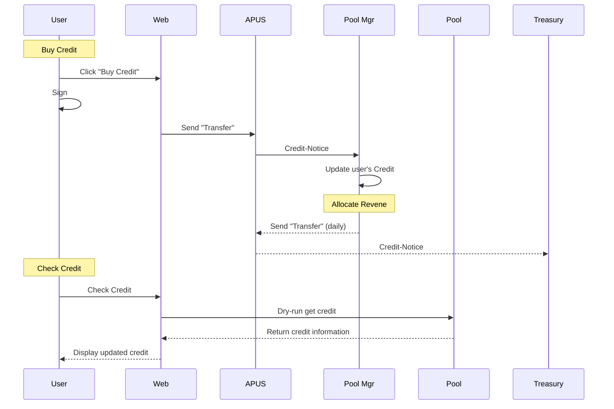
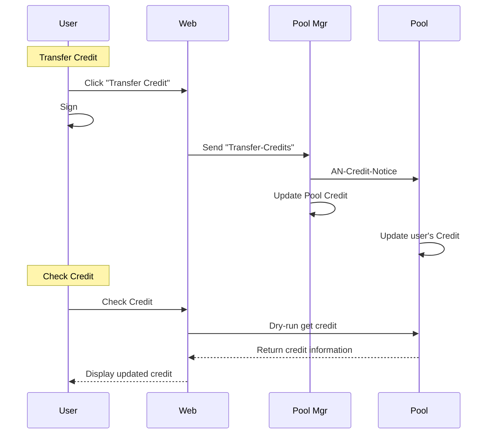
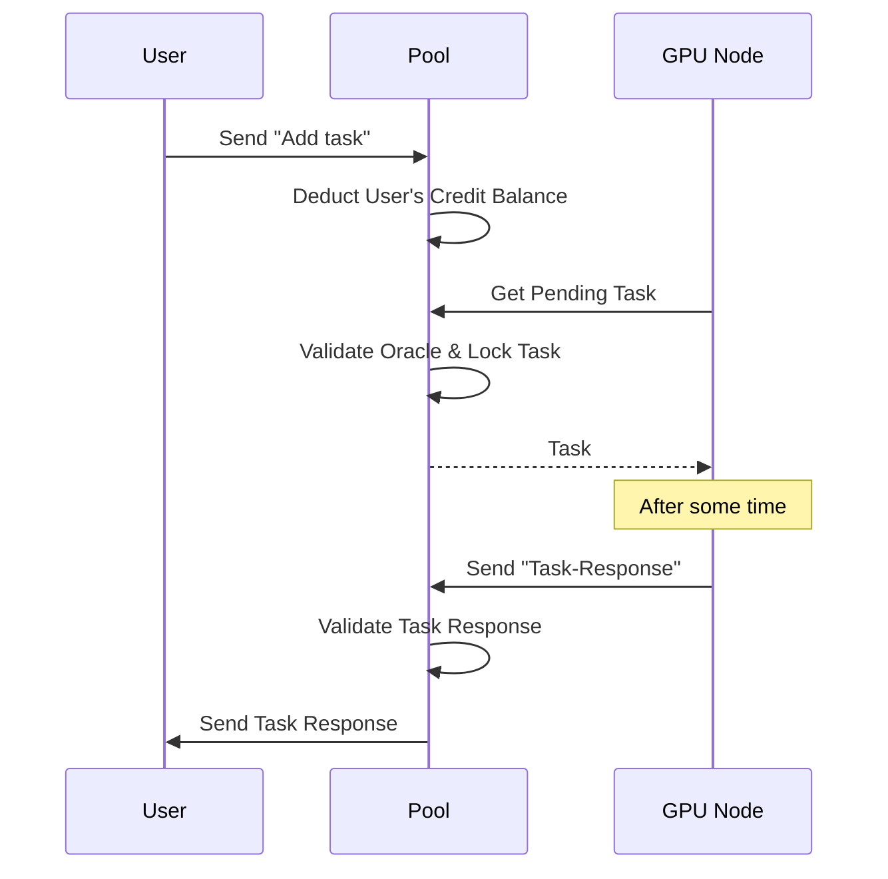
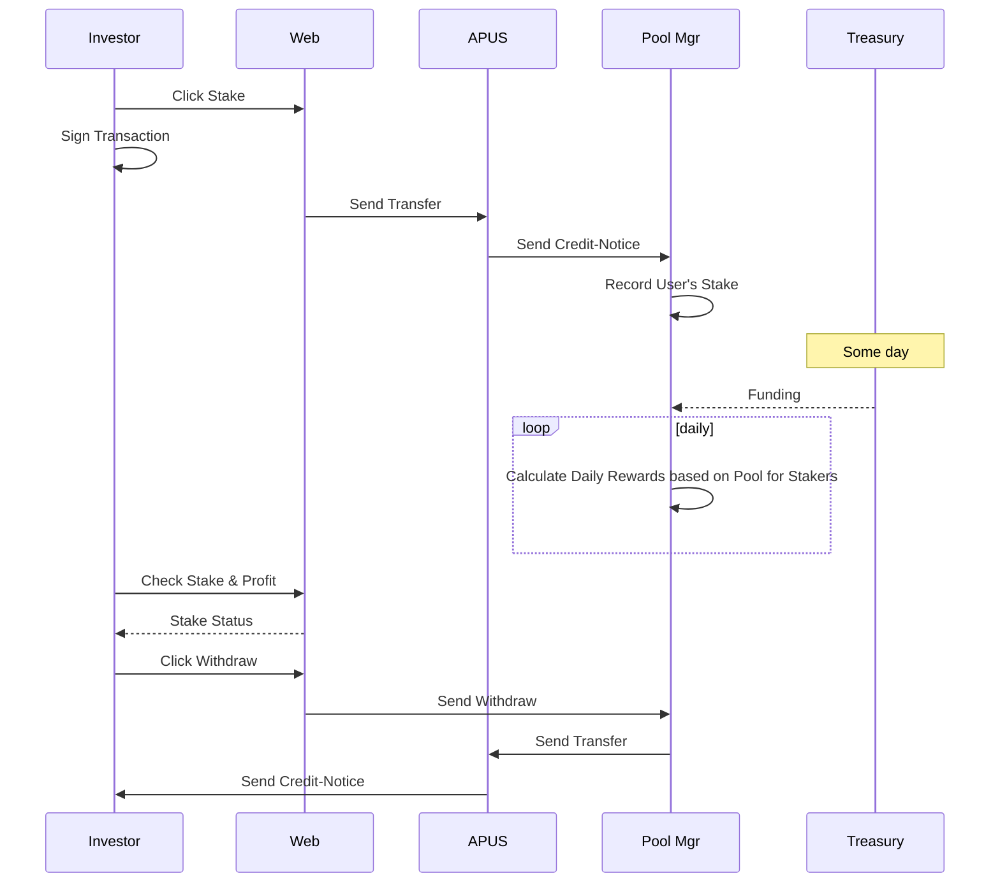
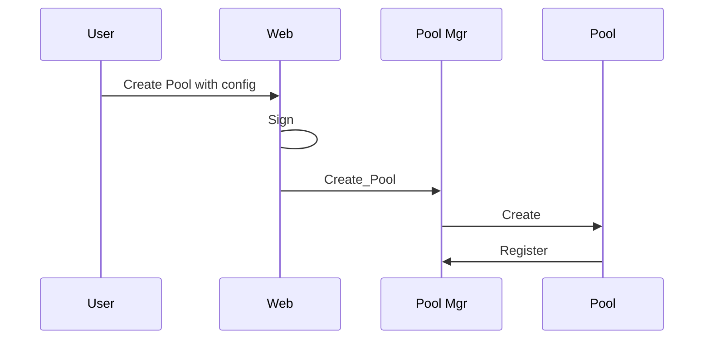

# ANPM HLD

Project: ANPM (Apus Pool Management) (https://www.notion.so/ANPM-Apus-Pool-Management-1c90787b399c8052a05ff3403ff1ba38?pvs=21)

# Demand

[ANPM (Apus Pool Management)](https://www.notion.so/ANPM-Apus-Pool-Management-1c90787b399c8052a05ff3403ff1ba38?pvs=21) 

# Arch

## Overall

## Dataflow

- [ ]  TODO : Create Pool

Create Pool

## Fundflow

Credits flow

Incentive

## Key flow

### User Buy Credits

### User Transfer Credits to Pool

### User Call AI Inference

### Investors Stake/Unstake

### TODO : Create Pool

# Module

| Product | Module | Feature | Owner |
| --- | --- | --- | --- |
| Web | Credits | Balance | @Jax |
|  |  | Charge |  |
|  |  | Exchange Rate |  |
|  |  | Transactions history |  |
|  | Pools | Pool List |  |
|  | Stake | Stake guide |  |
|  |  | Stake & profit status |  |
|  |  | Stake |  |
|  |  | Withdraw |  |
|  | Pool | Pool info |  |
|  |  | How to use AI |  |
|  |  | Price |  |
|  |  | Consume history |  |
|  |  | Task statistics |  |
| Process | Pool Mgr | Credit manage | @Alex |
|  |  | Pool manage |  |
|  |  | Pool statistics |  |
|  |  | Stake manage | @Jason |
|  |  | Incentive daily | @Jason |
|  |  | Exchange rate manage |  |
|  |  | Auto revene |  |
|  | Pool | Task manage | @Jax |
|  |  | Oracle manage |  |
| GPU Node | HyperBEAM | HTTP API | @Jax |
|  |  | Config support | @Alex |
|  |  | Determinstic ensure | @Jax @Alex |
|  | Oracle | Get Task & Return Result | @Jax |
|  |  | Resolve task by HyperBEAM |  |
| Operation | Token | Treasury Funding Pool Mgr | @Jason |

# Security

# Deploy

# Test