# ANPM LLD

Project: ANPM (Apus Pool Management) (https://www.notion.so/ANPM-Apus-Pool-Management-1c90787b399c8052a05ff3403ff1ba38?pvs=21)

# Context

[ANPM HLD](https://www.notion.so/ANPM-HLD-1d00787b399c80dd8dc7c999d563a233?pvs=21) 

**TBD**: *website figma link*

# Module

| Type | Module | Data Schema | API Interface | Arch Diagram | Owner |
| --- | --- | --- | --- | --- | --- |
| Process | Pool | y | y | y | @Jax  |
|  | Pool Mgr | y | y | y | @Jason Wu  |
| GPU Node | Oracle | n | n | y | @Jax  |
|  | HyperBEAM HTTP | n | y | n | @Jax  |

# Data Schema

## [Process] Pool

### [Enum] TASK_STATUS

- pending
- processing
- done
- ~~failed~~

TODO: 状态机

### [Map] task_raw_message

`Map<Reference, Message>`

### [Database] task

| Name | Type | Properties | Remark |
| --- | --- | --- | --- |
| ref | INTEGER | PK | Reference from AO message as pk. |
| status | TEXT | NOT NULL, Enum | `Task Status` |
| prompt | TEXT | NOT NULL | User’s prompt |
| config | TEXT |  | User’s config |
| resolve_node | TEXT |  | GPU Node’s uuid |
| output | TEXT |  | GPU Node’s response |
| created_at | INTEGER | NOT NULL | UNIX TIMESTAMP |
| updated_at | INTEGER | NOT NULL | UNIX TIMESTAMP |

### [Map] credit

`Map<wallet_address, bigint>`

### [List] Oracle

`List<Oracle>`

| Name | Type | Properties | Remark |
| --- | --- | --- | --- |
| node_id | INTEGER | PK | GPU node’s UUID |
| owner | TEXT | NOT NULL, AR Address | GPU node owner’s address |

## [Process] Pool Mgr

### 1.Credit manage @Yang Alex

### [Map] credits_distribution

### `Map<WalletAddress, List{PoolID,Credits}>`

PoolId = 0 → None-distributed credits 

### [Variable INT] credits_exchange_rate

- Configured only by Pool Mgr owner
- 1000 APUS to X credits

### [Database] credits_records

| Name | Type | Properties | Remark |
| --- | --- | --- | --- |
| wallet_address | TEXT | PK, AR address | User wallet address |
| action | TEXT | NOT NULL | Charge or transfer  |
| amount | INTEGER | NOT NULL , default 0 | Amount |
| created_at | INTEGER | NOT NULL | UNIX TIMESTAMP |

### [Database] pools

| Name | Type | Properties | Remark |
| --- | --- | --- | --- |
| pool_id | INTEGER | PK | Pool Unique id |
| creator | TEXT | NOT NULL | Creator address |
| created_at | INTEGER | NOT NULL | UNIX TIMESTAMP |
| staking capacity | INTEGER | NOT NULL, default 0 | Max Staking amount |
| rewards_amount | INTEGER | NOT NULL, default 0 | Rewards daily for each pool |
| started_at | INTEGER | NOT NULL | UNIX TIMESTAMP |

### 2.Staking @Jason Wu

### **[Database]user_staking_transactions**

| **Column Name** | **SQLite Type** | **Constraints** | **Description** |
| --- | --- | --- | --- |
| id | INTEGER | PRIMARY KEY, AUTOINCREMENT | Unique identifier for each staking transaction record. |
| user_wallet_address | TEXT | NOT NULL |  |
| pool_id | INTEGER | NOT NULL,  | ID of the staking pool |
| transaction_type | TEXT | NOT NULL | Type of transaction, e.g., 'STAKE' or 'UNSTAKE' |
| amount | TEXT | NOT NULL | Amount of APUS tokens involved in the transaction |
| created_at | INTEGER | NOT NULL, DEFAULT CURRENT_TIMESTAMP | Timestamp  |

### 3.Incentive

### **[Database]Interest**_distributions

| **Column Name** | **SQLite Type** | **Constraints** | **Description** |
| --- | --- | --- | --- |
| id | INTEGER | PRIMARY KEY, AUTOINCREMENT |  |
| user_wallet_address | TEXT | NOT NULL |  |
| amount | TEXT | NOT NULL |  |
| distribution_time | TEXT | NOT NULL, DEFAULT CURRENT_TIMESTAMP | Timestamp  |

# API Interface

## [Process] Pool

### Add-Credit

**Description**

Add User’s Credit Balance, only allow message from Pool Mgr.

**Handler name**

`Add-Credit`

**Handler pattern**

`{ Action = "AN-Credit-Notice", From = "<Pool Mgr Process ID>", Quantity = "_", User = "_" }`

**Message**

| Tag | Type | Value Type | Remark |
| --- | --- | --- | --- |
| Quantity | Tag | string | number of credit |
| User | Tag | string | user wallet address |

**Response**

1. Success
    
    Message with tag `code=200`
    

### Get-Credit-Balance

**Description**

Allow user to query credit balance

**Handler name**

`Get-Credit`

**Handler pattern**

`{ Action = "Credit-Balance" }`

**Message**

**Response**

1. Success
    
    ```json
    "0"
    ```

### Add-Task

**Description**

Accept task from User and add to task database.

**Handler name**

`Add-Task`

**Handler pattern**

`{ Action = "Add-Task" }`

**Message**

| Tag | Type | Value Type | Remark |
| --- | --- | --- | --- |
| prompt | Data field | string | User’s prompt |
| config | Data field | string | User’s config |

**Response**

1. Success
    
    Message with tag `code=200`
    
2. Balance not enough
    
    Message with tag `code=403`
    

### Get-Pending-Task

**Description**

Find a pending task, set it’s status to `Processing` , and return it.

**Handler name**

`Get-Tasks`

**Handler pattern**

`{ Action = "Get-Pending-Task" }`

**Message**

**Response**

1. Success
    
    `Task`
    
2. No pending task
    
    Message with tag `code=204`
    

### Task-Response

**Description**

Accept GPU Node’s return, set output for a task, and update it’s status.

**Handler name**

`Task-Response`

**Handler pattern**

`{ Action = "Task-Response" }`

**Message**

| Tag | Type | Value Type | Remark |
| --- | --- | --- | --- |
| X-Reference | Tag | number | ref field from task |
| output | Data | string | response from HyperBEAM |

**Response**

1. Success
    
    Message with tag `Code=200`
    
2. Task not found
    
    Message with tag `Code=404`
    

### Tasks-Statistics

**Description**

Return statistics of task.

**Handler name**

`Tasks-Statistics`

**Handler pattern**

`{ Action = "Tasks-Statistics" }`

**Message**

**Response**

```json
{
	"count": {
		"total": 0,
		"pending": 0,
		"processing": 0,
		"done": 0
	}
}
```

### Add-Node-Oracle

**Description**

Allow admin to add GPU Node Oracle

**Handler name**

`Add-Node-Oracle`

**Handler pattern**

`{ Action = "Add-Node-Oracle", From = "<Process Owner>" }`

**Message**

| Tag | Type | Value Type | Remark |
| --- | --- | --- | --- |
| id | Data field | string | UUID generated by node |

**Response**

1. Success
    
    Message with `Code=200`
    

### Remove-Node-Oracle

**Description**

Allow admin to remove GPU Node Oracle

**Handler name**

`Remove-Node-Oracle`

**Handler pattern**

`{ Action = "Remove-Node-Oracle", From = "<Pool Mgr Process ID>" }`

**Message**

| Tag | Type | Value Type | Remark |
| --- | --- | --- | --- |
| id | Data field | string | UUID generated by node |

**Response**

1. Success
    
    Message with `Code=200`
    
2. Not found
    
    Message with `Code=404`
    

### Get-Node-Oracles

**Description**

Allow everyone to get node oracles

**Handler name**

`Get-Node-Oracles`

**Handler pattern**

`{ Action = "Get-Node-Oracles" }`

**Message**

**Response**

```json
[
	{
		"uuid": "",
		"owner": "<AR Address>"
	}
]
```

## [Process] Pool Mgr

### Info

**Description**

Return pool info for web.

**Handler name**

`Info`

**Handler pattern**

`{ Action = "Info" }`

**Message**

**Response**

### 1.Credit manage @Yang Alex

- Credits related
    
    ### Buy-Credit(Transfer)
    
    **Description**
    
    Accept APUS from User and update Credits.
    
    **Handler name**
    
    `Transfer`
    
    **Handler pattern**
    
    `{ Action = "Credit-Notice" ,['X-AN-Reason']='Buy-Credit'}`
    
    ```erlang
    Send({Target=ao.id,Action="Transfer",Recipient="shUfg1ovwx0J-5y6A4HUOWJ485XHBZXoLe4vS2iOurU",Quantity='100',['X-AN-Reason']='Buy-Credit'})
    ```
    
    **Message**
    
    **Response**
    
    1. Succeed 200 with remaining credits
    2. failed
    
    ### Set-Credit-Ratio
    
    **Description**
    
    Set APUS to Credits exchange ratio
    
    **Handler name**
    
    `Set-Credit-Ratio`
    
    **Handler pattern**
    
    `{ Action = "Set-Credit-Ratio", From = "Pocess Owner ID"}`
    
    **Message**
    
    | Tag | Type | Value Type | Remark |
    | --- | --- | --- | --- |
    | amount | Data field | Integer | exchange ratio |
    
    **Response**
    
    1. Success
        
        Message with `Code=200`
        
    2. Failed
    
    ### Query-Credits
    
    **Description**
    
    Query current credits 
    
    **Handler name**
    
    `Query-Credit`
    
    **Handler pattern**
    
    `{ Action = "Query-Credit", From = "<User>" }`
    
    **Message**
    
    **Response**
    
    200 and All credits belong to this wallet
    
    ### Query-All-Credits(internal use)
    
    **Description**
    
    For internal use / backup
    
    **Handler name**
    
    `Show-Credit` 
    
    **Handler pattern**
    
    `{ Action = "Show-Credit", From = "<Pool Mgr Owner>"}`
    
    **Message**
    
    **Response**
    
    Succeed 200 and all credit information
    
- Pool related
    
    ### Transfer-Credits
    
    **Description**
    
    Transfer credits to exact pool and **send message to pool**
    
    **Handler name**
    
    `Tansfer-Credits`
    
    **Handler pattern**
    
    `{ Action = "Tansfer-Credits", From = "User"}`
    
    **Message**
    
    | Tag | Type | Value Type | Remark |
    | --- | --- | --- | --- |
    | pool_id | Data field | string | which pool |
    | amount | Interger | number |  |
    
    **Response**
    
    1. Success 200
    2. failed


### 2.Staking @Jason Wu

### Stake

**Description**

Investor stake APUS to earn Interests.Stakes held for less than the full 24-hour cycle do not participate in that cycle's distribution.

**Handler name**

`Tansfer` 

**Handler pattern**

`{ Action = "Credit-Notice" ,['X-AN-Reason']='Stake'}`

```json
Send({Target=ao.id,Action="Transfer",Recipient="shUfg1ovwx0J-5y6A4HUOWJ485XHBZXoLe4vS2iOurU",Quantity='100',['X-AN-Reason']='Stake'})
```

**Message**

**Response**

1. Success
    
    Notification:[Stake-Successed]
    
2. Failure
    
    No Message
    

### UnStake

**Description**

Investor unStake APUS from t

**Handler name**

`UnStake`

**Handler pattern**

`{ Action = "UnStake" }`

**Message**

| Name | Type | Value Type | Remark |
| --- | --- | --- | --- |
| amount | Data field | number |  > 0 |
| pool_Id | Data field | number |  |

**Response**

1. Success
    
    Notification:[UnStake-Successed]
    
2. Failure
    
    No Message
    

### Get-Staking

**Description**

Get the user current staking

**Handler name**

`Query-Staking`

**Handler pattern**

`{ Action = "Query-Staking",  “Pool-Id”="" }`

**Message**

**Response**

`Balance`

### Get-Pool-Staking

**Description**

Query the current total staked amount in the pool

**Handler name**

`Query-Pool-Staking`

**Handler pattern**

`{ Action = "Query-Pool-Staking",  “Pool-Id”="" }`

**Message**

**Response**

`Balance`

### Get-All-Staking

**Description**

For internal user / backup

**Handler name**

`Get-All-Staking` 

**Handler pattern**

`{ Action = "Get-All-Staking"}`

**Message**

**Response**

```json
StakingRecords
```

Succeed 200 and all credit information

### 3.Incentive

### Distribute interest

**Description**

Cron message. 

Only staked tokens that have matured for **at least 24 hours** are considered eligible for rewards. Any unstaking action resets the maturity timer.

`dailyRate = (R/S)`

- R: The fixed daily reward amount (e.g., 1000 tokens/day)
- S: The total staked amount (can vary daily).

Example:

```jsx
R = 1000 
S = 200000

dailyRate = 1000 / 200000 = 0.005 (0.5%)
```

**interest = userStake(exceed 24 hours) × dailyRate**

**User Example:**

Suppose Alice has staked **5,000 APUS**, and they have been staked for **more than 24 hours**, thus fully eligible.

Using the above daily rate example:

```json
userStake = 5000
dailyRate = 0.005

interest = 5000 × 0.005 = 25 APUS
```

**Handler name**

`Distribute-Interest`

**Handler pattern**

`{ Action = "Cron" }`

## [GPU Node] HyperBEAM HTTP

### Inference

**Method**

POST

**Path**

/~wasm-64@1.0/init/compute/results?function=run_inference

**Headers**

| Header | Type | Example |
| --- | --- | --- |
| parameters+list | string | encodeURI(prompt),encodeURI(config) |

**Body**

@test/aos-wasi-nn.wasm

**Example**

```bash
curl -X POST —location http://localhost:10000/~wasm-64@1.0/init/compute/results?function=run_inference -H 'parameters+list: prompt,config' -D @test/aos-wasi-nn.wasm
```

# Arch Diagram

## [Process] Pool

**Receive Credit**

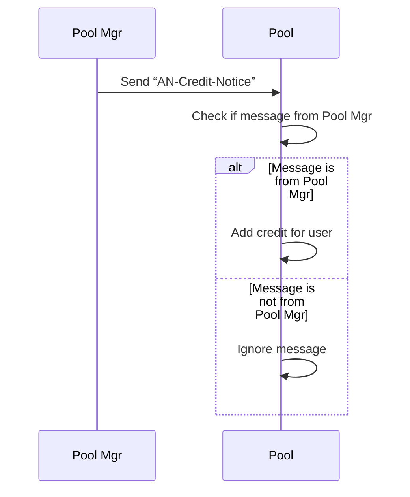

**Get Credit Balance**

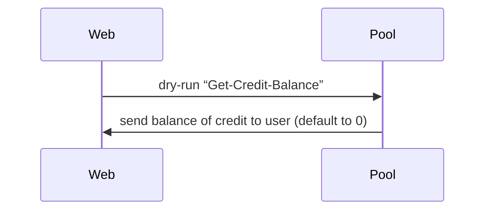

**Add Task**

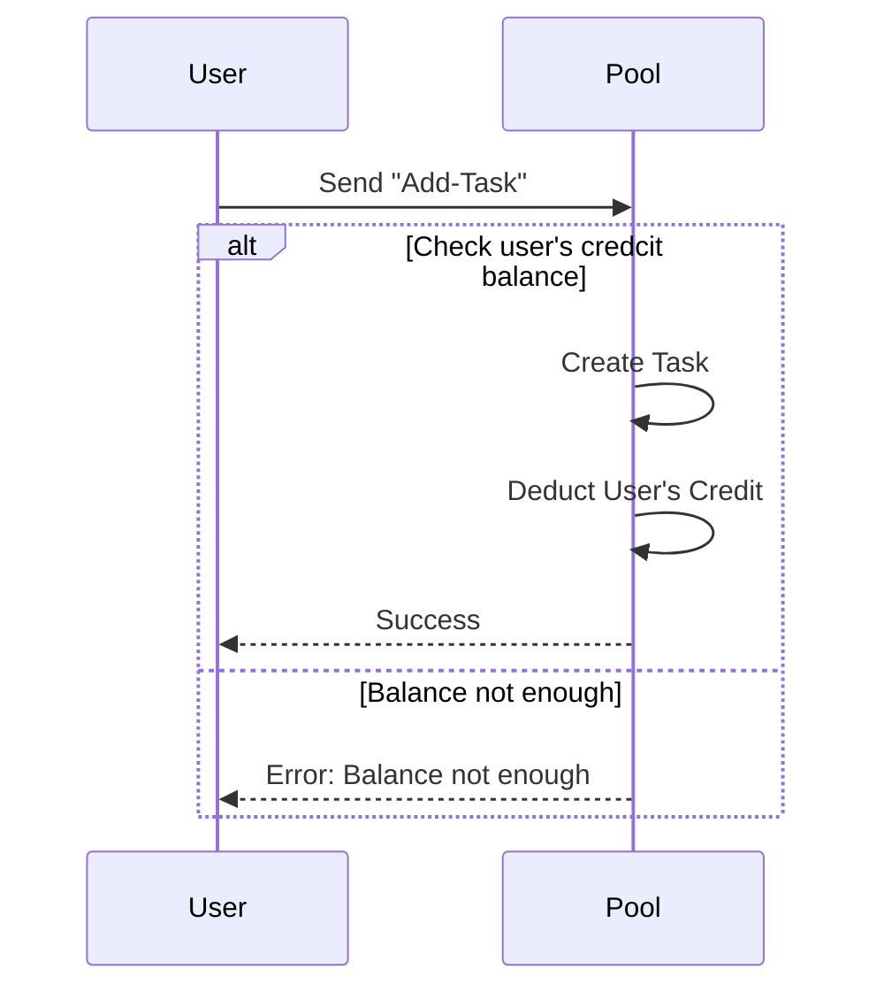

**Resolve Task**

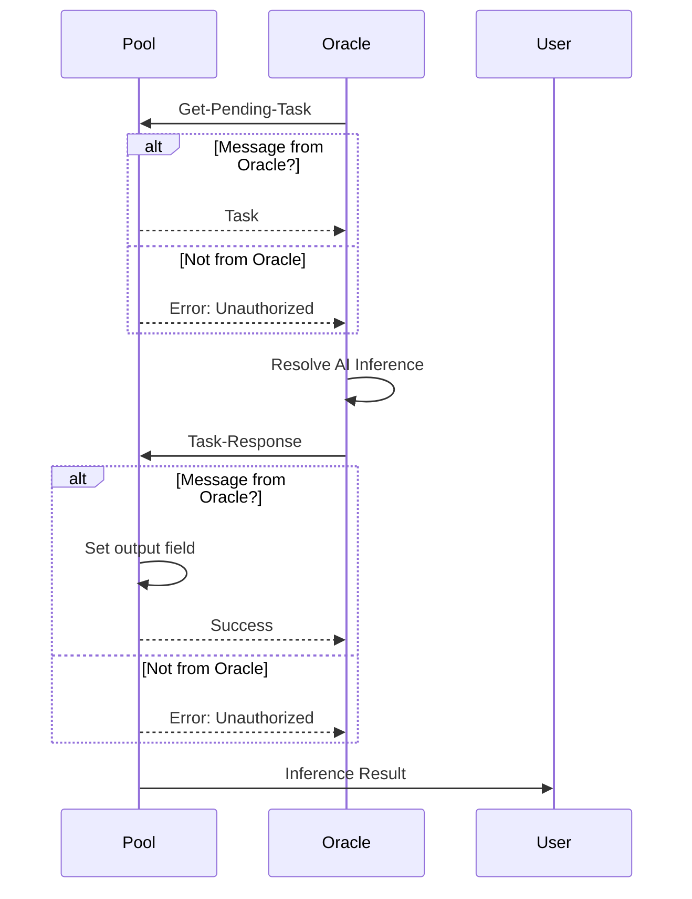

## [Process] Pool Mgr

**Buy Credits**

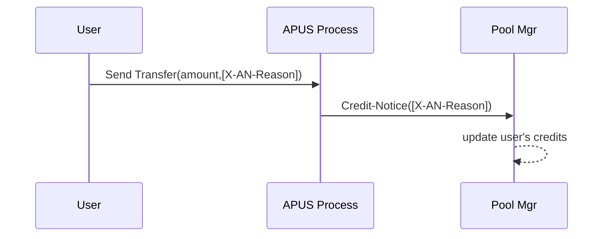

**Query Credits**

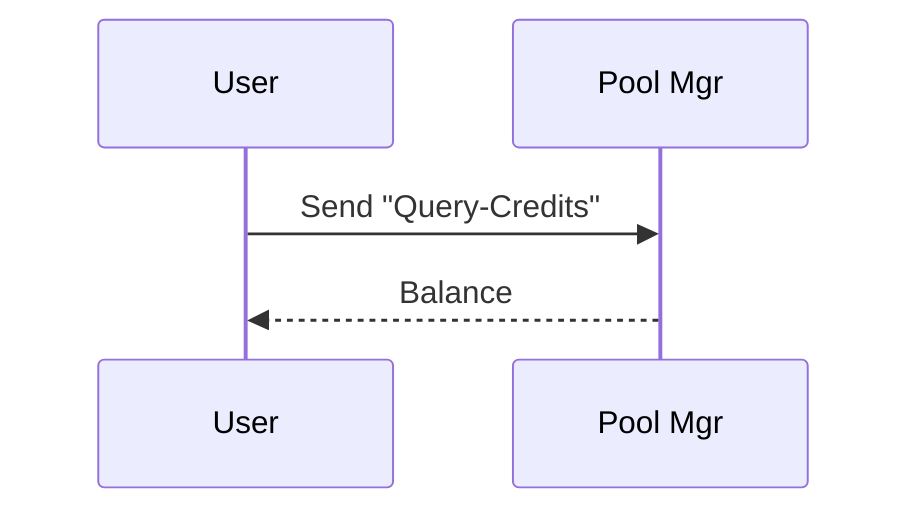

**Transfer Credits**

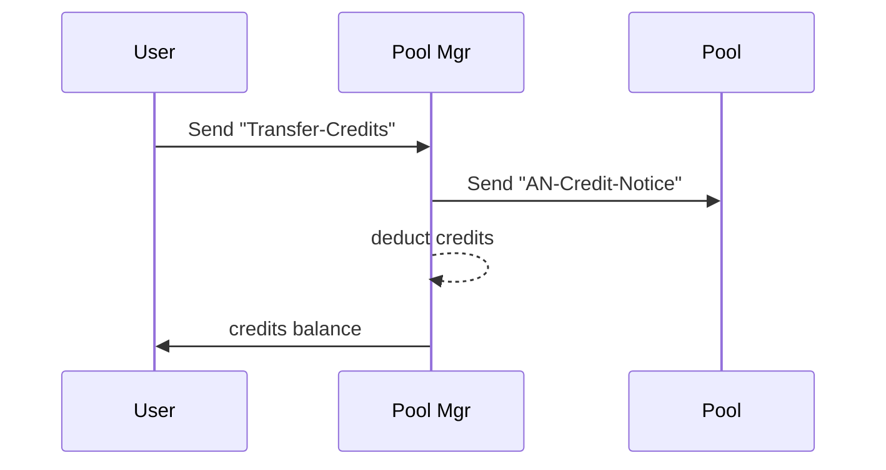

**Stake APUS**

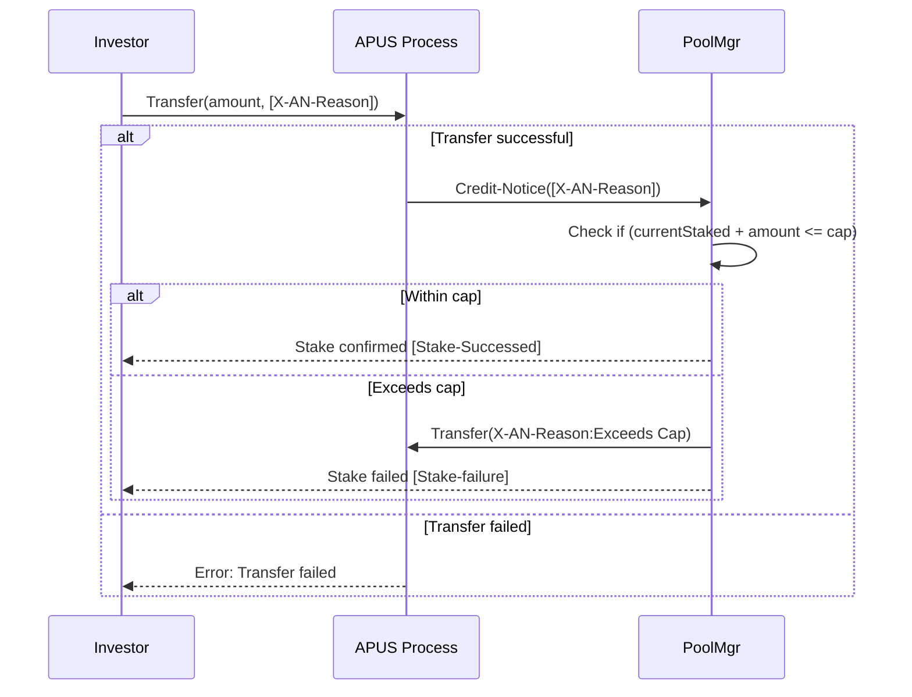

**UnStake APUS**

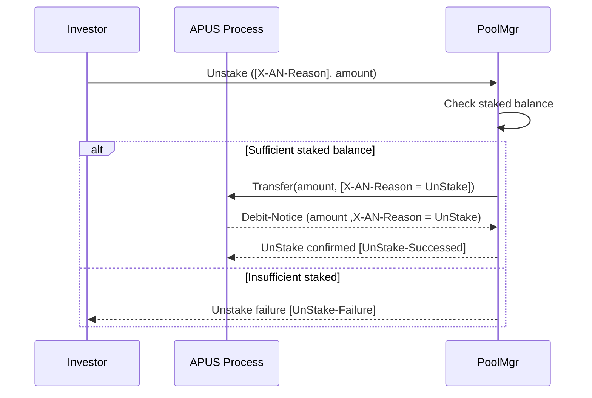

**Distribute-Interest**

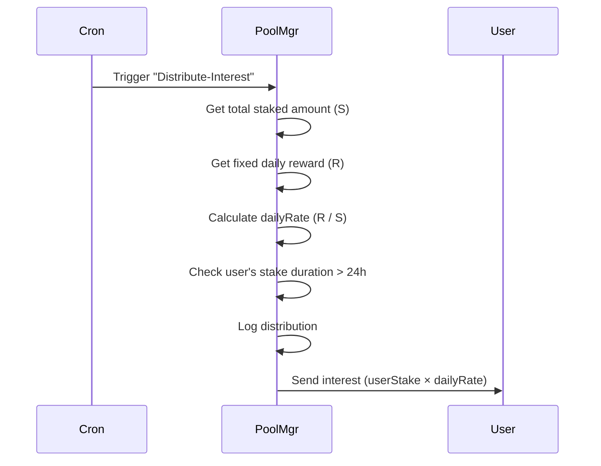

**Query-Staking**

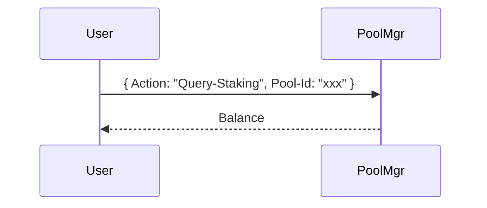

**Query-Pool-Staking**

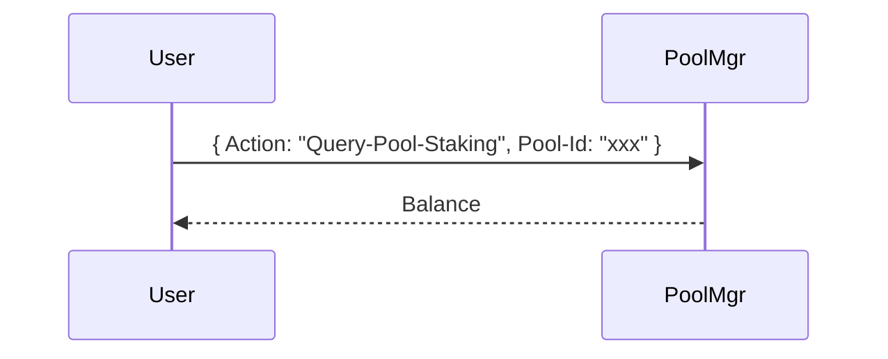

**Get-All-Staking**

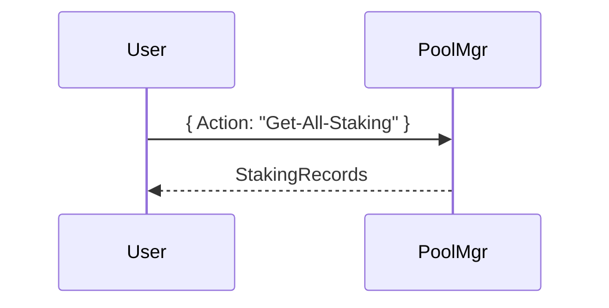

## [GPU Node] Oracle

Resolve Task

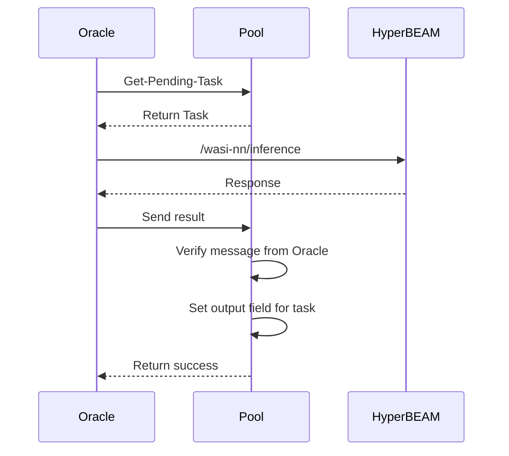